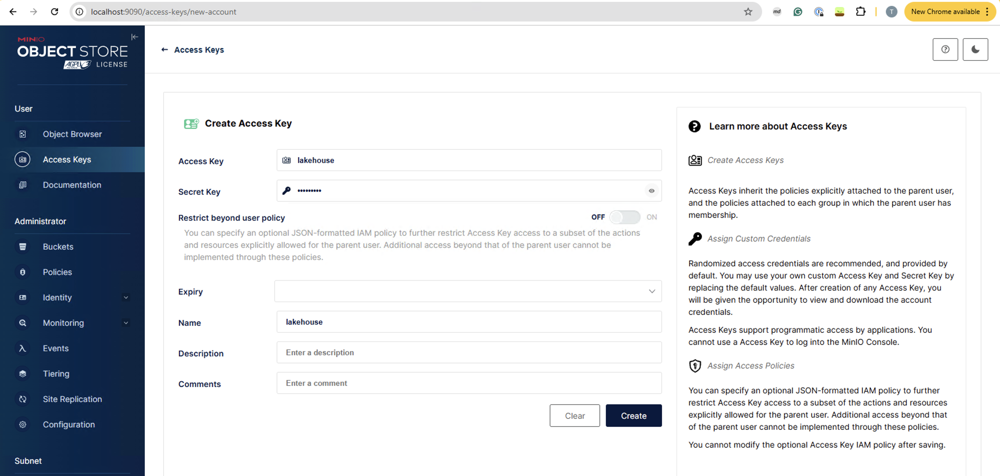

# Minikube Bootstrap
This repository contains a set of steps to bootstrap a minikube cluster with a set of services.

## Prerequisites
- [Minikube v1.35.0](https://minikube.sigs.k8s.io/docs/start/)
- [Docker Desktop (Mem >= 30G CPU >= 12)](https://docs.docker.com/desktop/)
- [Helm](https://helm.sh/)
- [kubectx](https://github.com/ahmetb/kubectx)
- [k9s](https://k9scli.io/)

## Getting Started
1. Start minikube
```bash
# Start minikube with docker driver. Ideally, memory should be >= 16G and CPU should be >= 8.
minikube start --driver=docker --cpus=12 --memory=30g
```
The output should look like this:
```bash
😄  minikube v1.35.0 on Darwin 15.3.2 (arm64)
✨  Using the docker driver based on user configuration
📌  Using Docker Desktop driver with root privileges
👍  Starting "minikube" primary control-plane node in "minikube" cluster
🚜  Pulling base image v0.0.46 ...
🔥  Creating docker container (CPUs=12, Memory=30720MB) ...
💾  Downloading Kubernetes v1.32.0 preload ...
    > preloaded-images-k8s-v18-v1...:  314.92 MiB / 314.92 MiB  100.00% 11.11 M
    > gcr.io/k8s-minikube/kicbase...:  452.84 MiB / 452.84 MiB  100.00% 8.18 Mi
🐳  Preparing Kubernetes v1.32.0 on Docker 27.4.1 ...
    ▪ Generating certificates and keys ...
    ▪ Booting up control plane ...
    ▪ Configuring RBAC rules ...
🔗  Configuring bridge CNI (Container Networking Interface) ...
🔎  Verifying Kubernetes components...
    ▪ Using image gcr.io/k8s-minikube/storage-provisioner:v5
🌟  Enabled addons: storage-provisioner, default-storageclass
🏄  Done! kubectl is now configured to use "minikube" cluster and "default" namespace by default
```

Check if the context is switched to `minikube` by running the following command:
```bash
>> kubectx minikube
```

2. Installing Ray Helm Chart (https://github.com/ray-project/kuberay/blob/master/helm-chart/ray-cluster/README.md)
```bash
# Step 1: Register a Helm chart repo
helm repo add kuberay https://ray-project.github.io/kuberay-helm/

# Step 2: Install both CRDs and KubeRay operator v1.1.0.
helm install kuberay-operator kuberay/kuberay-operator --version 1.1.0

# Step 3: Install a RayCluster custom resource
# (For x86_64 users)
helm install raycluster kuberay/ray-cluster --version 1.1.0
# (For arm64 users, e.g. Mac M1)
# See here for all available arm64 images: https://hub.docker.com/r/rayproject/ray/tags?page=1&name=aarch64
helm install raycluster kuberay/ray-cluster --version 1.1.0 --set image.tag=nightly-aarch64

# Step 4: Verify the installation of KubeRay operator and RayCluster
kubectl get pods
# NAME                                          READY   STATUS    RESTARTS   AGE
# kuberay-operator-6fcbb94f64-gkpc9             1/1     Running   0          89s
# raycluster-kuberay-head-qp9f4                 1/1     Running   0          66s
# raycluster-kuberay-worker-workergroup-2jckt   1/1     Running   0          66s

# Step 5: Forward the port of Dashboard
kubectl port-forward svc/raycluster-kuberay-head-svc 8265:8265

# Step 6: Check 127.0.0.1:8265 for the Dashboard

# Step 7: Uninstall RayCluster
# helm uninstall raycluster
```

3. Installing Onyx Helm Chart (https://github.com/onyx-dot-app/onyx/tree/main/deployment/helm/charts/onyx)
```bash
# Step1: Installing packaged Onyx Helm Chart (It'll take about 10-15 mins to finish the installation)
helm install onyx-stack onyx-stack-0.2.1.tgz

# Step2: Verify the installation of Onyx stack
kubectl get pods

# Step 3: Minikube assign an external IP to the Onyx Nginx. This will prompt a browser to open the URL
minikube service onyx-stack-nginx

# Step 4: Uninstall Onyx
# helm uninstall onyx-stack
```

> How to package Onyx Helm chart?
>```bash
># Step 1: Clone the Onyx repository
>git clone https://github.com/onyx-dot-app/onyx.git
>
># Step 2: Change directory to the Onyx deployments
>cd onyx/deployment
>
># Step 3: Package the Helm chart
>helm package helm/charts/onyx -u
>```

4. Installing Postgres Helm Chart
```bash
# Step 1: Add the Bitnami Helm chart repository
helm repo add bitnami https://charts.bitnami.com/bitnami
helm repo update

# Step 2: Install the Postgres with persistence storage
helm install postgres bitnami/postgresql --set auth.postgresPassword=postgrespassword,auth.username=postgres,auth.password=postgres,primary.persistence.enabled=true,replica.persistence.enabled=false

# Step 3: Verify the installation of Postgres
kubectl get pods

# Step 4: Port forward the Postgres service to access it locally
kubectl port-forward svc/postgres-postgresql 5432:5432

# Step 5: Connect to the Postgres database: postgres:postgres@localhost:5432/postgres

# Step 6: Uninstall Postgres
# helm uninstall postgres
```


### Installing Data Lakehouse

> Based on https://resethard.io/oss-data-lakehouse/ 

Components include:
- MinIO - S3 compliant object store for data storage.
- Apache Parquet - columnar storage format.
- Apache Iceberg - open table format and metadata.
- Nessie - data catalog with some interesting Git-like features (a more battle-tested alternative would be Hive).
- Apache Spark - data processing framework, version 3+.

1. Installing MinIO (https://min.io/docs/minio/kubernetes/upstream/operations/install-deploy-manage/deploy-operator-helm.html)
```bash
# Step 1: Add the minio-operator Helm chart repository
helm repo add minio-operator https://operator.min.io
helm repo update

# Step 2: Install minio-operator with namespace lakehouse
helm install minio-operator minio-operator/operator \
  --namespace lakehouse \
  --create-namespace

# Step 3: Install a minio tenant
helm install minio-tenant minio-operator/tenant \
--namespace lakehouse \
--values lakehouse/minio-tenant-values.yaml

# Step 4: Port forward minio tenant console
kubectl port-forward svc/myminio-console 9443:9443 -n lakehouse

# Step5: Access to minio console with http://localhost:9090
# Username/Password: minio/minio123

# Step 6: Create buckets in the console
```

> We also need to create access key (`lakehouse`) and secret key (`lakehouse`) in the Minio tenant console as shown below:
> 

2. Installing Nessie for Data Catalog
```bash
# Step 1: Add the nessie Helm chart repository
helm repo add nessie-helm https://charts.projectnessie.org
helm repo update

# Step 2: Install Nessie with in-memory database
helm install --namespace lakehouse nessie nessie-helm/nessie

# Step 3: Port forward to Nessie
kubectl --namespace lakehouse port-forward svc/nessie 19120:19120

# Step 4: Connect to Nessie at http://localhost:19120
```

3. Installing Spark Operator (https://www.kubeflow.org/docs/components/spark-operator/getting-started/)
```bash
# Step 1: Add the spark-operator Helm chart repository
helm repo add spark-operator https://kubeflow.github.io/spark-operator
helm repo update

# Step 2: Install Spark-operator
# There should be a service account `spark-operator-spark` created automatically
helm install spark-operator spark-operator/spark-operator \
    --namespace lakehouse \
    --set "spark.jobNamespaces={lakehouse}" --set webhook.enable=true

# Step 3: Test if can submit a Spark job
kubectl apply -f lakehouse/spark-py-pi.yaml

# Step 4: Check the SparkApplication status
#kubectl get sparkapplication --namespace lakehouse
```

> Submit a Spark ETL job:
>
>Prerequisites:
>- File "raw/people.txt" is saved in Minio bucket "raw".
>
> Steps:
>1. Build Docker image and push to minikube registry (Powershell https://minikube.sigs.k8s.io/docs/handbook/pushing/#Windows)
>```bash
>& minikube -p minikube docker-env --shell powershell | Invoke-Expression
>
>cd ./lakehouse/spark-etl
>
>docker build -t spark-etl:v1.0.0 .
>```
>Check to see if the image is minikube registry
> ```
> minikube image ls --format table
>```
>
> 2. Submit the Spark Application to K8s Spark operator
>
>```bash
> kubectl apply -f spark-etl.yaml
>```

### Installing Airflow
```bash
# Step 1: Add Apache-airflow Helm chart repo
helm repo add apache-airflow https://airflow.apache.org
helm repo update

# Step 2: Install Airflow
helm upgrade --install airflow \
    apache-airflow/airflow \
    --namespace airflow --create-namespace

# Step 3: Port forward Airflow UI
 kubectl port-forward svc/airflow-webserver 8081:8080 --namespace airflow

# Step 4: Access Airflow by http://localhost:8081 (username/password: admin/admin)
```

# TODO
> To upload DAGs to DAG folder: ...

### Installing JupyterHub
```bash
# Step 1: Add Jupyterhub Helm chart repo
helm repo add jupyterhub https://hub.jupyter.org/helm-chart/
helm repo update

# Step 2: Install JupyterHub
helm upgrade --cleanup-on-fail \
  --install jupyterhub jupyterhub/jupyterhub \
  --namespace jupyter \
  --create-namespace \
  --version=3.3.5

# Step 3: Port forward JupyterHub UI
 kubectl --namespace=jupyter port-forward service/proxy-public 8080:http

# Step 4: Access to JupyterHub by http://localhost:8080
```

> Default username/password is `jovyan`/`jupyter`.
